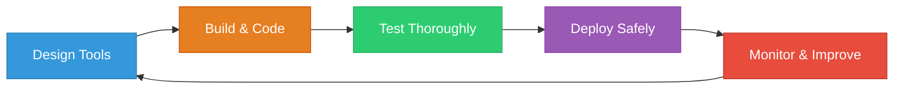

<Card title="Building Excellent Bhindi Agents" icon="star">
  Creating great Bhindi agents requires following established best practices for
  tool design, performance optimization, testing, and deployment. This guide
  covers the essential practices that will help you create reliable,
  maintainable, and user-friendly agents.
</Card>

## Development Workflow



<Note>
  Great agents are built iteratively - design thoughtfully, implement carefully,
  test thoroughly, and improve continuously.
</Note>

## Tool Design Excellence

<Tabs>
  <Tab title="Naming & Descriptions">
    <Card title="Clear Naming Conventions" icon="tag">
      Use descriptive, action-oriented names that clearly indicate what the tool does.
    </Card>

    ### ✅ Good Examples

    <CardGroup cols={2}>
      <Card title="sendMessage" icon="paper-plane">
        ```typescript
        {
          "name": "sendMessage",
          "description": "Send a message to a Slack user or channel. Supports both direct messages and channel posts. Messages can include text, emojis, and basic formatting. Maximum message length is 4000 characters."
        }
        ```
      </Card>

      <Card title="createPage" icon="file-plus">
        ```typescript
        {
          "name": "createPage",
          "description": "Create a new page in Notion workspace with custom properties and content blocks"
        }
        ```
      </Card>
    </CardGroup>

    ### ❌ Bad Examples

    <CardGroup cols={2}>
      <Card title="execute" icon="times">
        ```typescript
        {
          "name": "execute",
          "description": "Execute something"
        }
        ```
        **Too generic and unclear**
      </Card>

      <Card title="process" icon="times">
        ```typescript
        {
          "name": "process",
          "description": "Process the request"
        }
        ```
        **Doesn't explain what it actually does**
      </Card>
    </CardGroup>

    <Tip>
      Use action verbs like `send`, `create`, `update`, `delete`, `get`, `list` to make tool purposes immediately clear.
    </Tip>

  </Tab>

  <Tab title="Parameters">
    <Card title="Smart Parameter Design" icon="sliders">
      Design parameters with user experience in mind - clear descriptions, examples, and sensible defaults.
    </Card>

    ### Well-Designed Parameters

    ```typescript
    {
      "parameters": {
        "type": "object",
        "properties": {
          "recipient": {
            "type": "string",
            "description": "Name or ID of the user/channel to send message to",
            "examples": ["#general", "@john.doe", "C1234567890"]
          },
          "message": {
            "type": "string",
            "description": "Message content to send",
            "maxLength": 4000
          },
          "threadTs": {
            "type": "string",
            "description": "Thread timestamp to reply to an existing thread (optional)",
            "optional": true
          }
        },
        "required": ["recipient", "message"]
      }
    }
    ```

    ### Smart Defaults

    <Card title="Provide Helpful Defaults" icon="magic">
      Set sensible defaults that work for most use cases while allowing customization when needed.
    </Card>

    ```typescript
    {
      "properties": {
        "visibility": {
          "type": "string",
          "enum": ["public", "private", "internal"],
          "default": "private",
          "description": "Repository visibility setting"
        },
        "limit": {
          "type": "number",
          "default": 50,
          "minimum": 1,
          "maximum": 100,
          "description": "Maximum number of items to return"
        }
      }
    }
    ```

    <Warning>
      Avoid requiring parameters that could have reasonable defaults. Only mark parameters as required if they're truly essential.
    </Warning>

  </Tab>

  <Tab title="User Experience">
    <Card title="Optimize for User Experience" icon="user">
      Think from the user's perspective - what information do they need? What would be confusing? How can you make it easier?
    </Card>

    ### Confirmation Requirements

    <CardGroup cols={2}>
      <Card title="Require Confirmation" icon="check-square">
        **For destructive actions:**
        - Deleting files/data
        - Sending messages to large groups
        - Making public posts
        - Financial transactions
      </Card>

      <Card title="Skip Confirmation" icon="lightning">
        **For safe actions:**
        - Reading/getting data
        - Creating drafts
        - Searching content
        - Simple calculations
      </Card>
    </CardGroup>

    ### Visible Parameters

    ```typescript
    {
      "name": "sendEmail",
      "description": "Send an email message",
      "visibleParameters": ["to", "subject", "body"],
      // Hide technical parameters like API endpoints, auth tokens, etc.
    }
    ```

    <Tip>
      Show users only the parameters they need to think about. Hide technical configuration from the UI.
    </Tip>

  </Tab>
</Tabs>

## Code Quality Standards

<CardGroup cols={2}>
  <Card title="Input Validation" icon="shield">
    **Always validate all inputs**
    
    - Check parameter types and formats
    - Validate ranges and lengths
    - Sanitize user data
    - Prevent injection attacks
    
    ```typescript
    // Validate email format
    const emailRegex = /^[^\s@]+@[^\s@]+\.[^\s@]+$/;
    if (!emailRegex.test(email)) {
      throw new Error('Invalid email format');
    }
    ```
  </Card>

  <Card title="Error Handling" icon="bug">
    **Provide helpful error messages**
    
    - Use clear, non-technical language
    - Suggest how to fix the problem
    - Include relevant context
    - Don't expose sensitive data
    
    ```typescript
    // Good error message
    {
      "message": "Channel not found",
      "code": "CHANNEL_NOT_FOUND",
      "details": "The channel '#marketing' doesn't exist or you don't have access to it"
    }
    ```
  </Card>

<Card title="Performance" icon="tachometer-alt">
  **Optimize for speed** - Keep response times under 5 seconds - Use efficient
  algorithms - Cache when appropriate - Implement timeouts - Handle rate limits
  gracefully
</Card>

  <Card title="Security" icon="lock">
    **Build security in from the start**
    
    - Validate all authentication
    - Use HTTPS everywhere
    - Don't log sensitive data
    - Implement rate limiting
    - Follow least privilege principle
  </Card>
</CardGroup>

---

<Card title="Ready to Build Your Agent?" icon="rocket">
  Follow these best practices to create agents that users love. Check out our
  [quickstart guide](/custom-agent/quickstart) to start building, or review the
  [agent specification](/agents/agent-specification) for technical details.
</Card>
