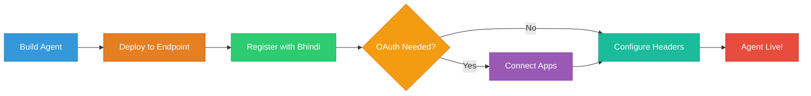

<Card title="Deploy Your Custom Agent" icon="rocket">
  Ready to bring your agent to life? This guide walks you through the complete
  integration process, from deployment to configuration, making your custom
  agent available to all Bhindi users.
</Card>

## Integration Overview



<Info>
  The entire integration process typically takes less than 10 minutes once your
  agent is built and deployed.
</Info>

## Step-by-Step Integration

<Steps>
  <Step title="Build & Deploy Your Agent" icon="hammer">
    **Prepare your agent for production**
    
    - Build your agent following our [development guide](/custom-agent/development-process)
    - Deploy it to a publicly accessible HTTPS endpoint
    - Verify both `/tools` and `/tools/:toolName` endpoints are responding correctly
    - Test your agent locally before deployment
    
    <Tip>
      Use services like Railway, Vercel, or Heroku for easy deployment. Make sure your endpoint supports HTTPS.
    </Tip>
  </Step>

  <Step title="Register with Bhindi" icon="plus">
    **Add your agent to the Bhindi ecosystem**
    
    1. Start a new chat on [Bhindi.io](https://bhindi.io)
    2. Use the **Bhindi Agent Manager** with this format:

    <Card title="Basic Agent Registration" icon="code">
      ```
      Add my agent using Bhindi Agent Manager. The details are as follows:

      id: your-agent-id
      name: Your Agent Name
      description: Your Agent Description
      endpoint: https://your-agent-endpoint.com
      ```
    </Card>

    <Card title="Agent with OAuth Services" icon="link">
      ```
      Add my agent using Bhindi Agent Manager. The details are as follows:

      id: my-github-analyzer
      name: GitHub Repository Analyzer
      description: Analyzes GitHub repositories and provides insights
      endpoint: https://my-github-analyzer.com
      oauth: github, discord
      ```
    </Card>

  </Step>

  <Step title="Configure Advanced Settings" icon="gear">
    **Set up OAuth and custom headers (if needed)**
    
    <Tabs>
      <Tab title="OAuth Configuration">
        <Card title="Connect Required Services" icon="key">
          For agents needing access to external services like GitHub, Google, Discord, etc.
        </Card>

        **Before registering your agent:**
        1. Visit [bhindi.io/apps](https://bhindi.io/apps)
        2. Connect all required services your agent needs
        3. Include the OAuth services in your registration message

        <Warning>
          OAuth agents only get access to predefined scopes configured in Bhindi, ensuring secure and limited access to connected accounts.
        </Warning>
      </Tab>

      <Tab title="Custom Headers">
        <Card title="Configure Agent Headers" icon="list">
          Set up custom headers for API keys, endpoints, and other configuration.
        </Card>

        **After your agent is registered:**
        1. Go to [Apps](https://bhindi.io/apps)
        2. Find your agent in the list
        3. Click the `Configure` button
        4. Add necessary headers and save configuration

        <Info>
          Custom headers are perfect for API keys, project IDs, or service-specific configurations your agent needs.
        </Info>
      </Tab>
    </Tabs>

  </Step>
</Steps>

## Registration Requirements

<CardGroup cols={2}>
  <Card title="Required Fields" icon="asterisk">
    **Must be provided for all agents**
    
    - **id**: Unique identifier (lowercase, hyphens allowed)
    - **name**: Display name for your agent
    - **description**: Clear explanation of capabilities
    - **endpoint**: Public HTTPS URL
  </Card>

  <Card title="Optional Fields" icon="plus">
    **Additional configuration options**
    
    - **oauth**: Comma-separated list of services
    - **headers**: Set up after registration
    - **scopes**: Defined by Bhindi for security
  </Card>
</CardGroup>

### Field Guidelines

<CardGroup cols={2}>
  <Card title="ID Naming" icon="tag">
    **Best practices for agent IDs**
    <br />
   - ✅ `my-github-analyzer`
   - ✅ `slack-bot-helper`
   - ✅ `email-assistant`
    
   - ❌ `MyAgent123`
   - ❌ `agent_with_spaces`
   - ❌ `UPPERCASE-ID`
  </Card>

  <Card title="Description Tips" icon="pen">
    **Writing effective descriptions**
    
    - Be specific about what your agent does
    - Mention key features and use cases
    - Keep it under 200 characters
    - Use action-oriented language
    
    *Example: "Analyzes GitHub repositories, tracks issues, and provides development insights with automated reporting"*
  </Card>
</CardGroup>

## OAuth Integration

<Card title="Supported OAuth Services" icon="shield">
  Your agent can request access to any of the 15+ integrations available in the
  Bhindi ecosystem, including GitHub, Google Workspace, Discord, Slack, and
  more.
</Card>

<Tabs>
  <Tab title="How OAuth Works">
    <Steps>
      <Step title="User Connects Apps" icon="link">
        Users connect their accounts at [bhindi.io/apps](https://bhindi.io/apps) before using OAuth agents.
      </Step>

      <Step title="Agent Requests Access" icon="key">
        Your agent specifies which OAuth services it needs during registration.
      </Step>

      <Step title="Secure Access Granted" icon="shield">
        Bhindi provides limited access tokens with predefined scopes only.
      </Step>
    </Steps>

  </Tab>

  <Tab title="Security Model">
    <Card title="Limited Scope Access" icon="lock">
      Your custom agent will only get access to specific, predefined scopes - not full authentication access to user accounts.
    </Card>

    **Security Benefits:**
    - No direct access to user credentials
    - Limited to necessary permissions only
    - Tokens are managed by Bhindi
    - Regular security audits and monitoring

    <Info>
      This security model protects both users and agent developers by limiting access to only what's needed.
    </Info>

  </Tab>

  <Tab title="Available Services">
    <Card title="Popular OAuth Integrations" icon="plug">
      Connect your agent to popular services that users already love.
    </Card>
    **Development & Code:**
    - GitHub
    - Linear
    - DigitalOcean

    **Google Workspace:**
    - Google Sheets
    - Google Calendar
    - Google Docs
    - Google Forms
    - Gmail

    **Productivity & Communication:**
    - Notion
    - Trello
    - Slack
    - Typeform
    - Reddit

    **And many more!** Check [bhindi.io/apps](https://bhindi.io/apps) for the complete list.

  </Tab>
</Tabs>

## Integration Support

<CardGroup cols={2}>
  <Card title="Bhindi Agent Manager" icon="robot">
    **Your integration assistant**
    
    The Bhindi Agent Manager will guide you through the entire integration process and help resolve any issues during setup.
    
    - Real-time guidance during registration
    - Automatic validation of endpoints
    - Troubleshooting support
    - Configuration assistance
  </Card>

  <Card title="Getting Help" icon="question">
    **Need assistance?**
    
    - Use the Agent Manager in any Bhindi chat
    - Check our [development guide](/custom-agent/development-process)
    - Review [best practices](/agents/best-practices)
    - Test endpoints before registration
  </Card>
</CardGroup>

## Quick Integration Checklist

<Card title="Pre-Integration Checklist" icon="clipboard-check">
  Ensure everything is ready before registering your agent.
</Card>

**Before Registration:**

- [ ] Agent is built and tested locally
- [ ] Deployed to publicly accessible HTTPS endpoint
- [ ] `/tools` endpoint returns valid JSON
- [ ] `/tools/:toolName` endpoint handles requests correctly
- [ ] Required OAuth apps connected (if applicable)
- [ ] Agent ID is unique and follows naming conventions

**After Registration:**

- [ ] Agent appears in your apps list
- [ ] Custom headers configured (if needed)
- [ ] Test agent in Bhindi chat
- [ ] Verify OAuth permissions work correctly
- [ ] Monitor agent performance and errors

---

<Card title="Ready to Deploy?" icon="rocket">
  Your agent is just minutes away from being live! Start the integration process
  by chatting with the **Bhindi Agent Manager** at
  [Bhindi.io](https://bhindi.io).
</Card>
