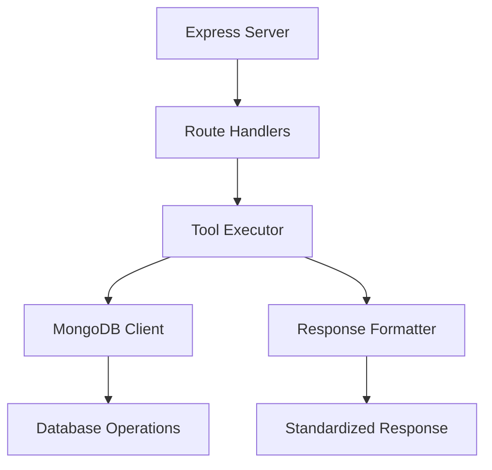

This guide walks you through how Bhindi MongoDB agents work internally, using our Express starter kit as a reference implementation.

## Architecture Overview

Bhindi MongoDB agents follow a modular, service-oriented architecture:



<CardGroup cols={2}>
<Card title="Separation of Concerns" icon="layer-group">
Each component has a single responsibility, making the codebase maintainable and testable.
</Card>

<Card title="Type Safety" icon="shield-check">
  Full TypeScript support ensures compile-time error checking and better
  developer experience.
</Card>

<Card title="Scalable Design" icon="arrow-up">
  Easy to add new tools and extend functionality without breaking existing
  features.
</Card>

<Card title="Error Handling" icon="triangle-exclamation">
Comprehensive error handling with standardized error responses and logging.
</Card>
</CardGroup>

## Files and Folder Structure

<Tabs>
<Tab title="Complete Structure">
```
bhindi-starter-kit-express/
├── src/                          # Source code directory
│   ├── types/                    # Type definitions
│   │   └── tool.ts              # Tool interfaces and response types
│   ├── db/                      # Database layer
│   │   └── db.ts               # MongoDB connection and client
│   ├── tools/                   # Tool implementations
│   │   ├── defination/          # Tool schema definitions
│   │   │   └── mongodb-tool.ts # Tool configurations and schemas
│   │   ├── createDocument/      # Create document tool
│   │   │   └── index.ts        # Implementation logic
│   │   └── listDocuments/       # List documents tool
│   │       └── index.ts        # Implementation logic
│   └── index.ts                # Express server and routing
├── package.json                 # Dependencies and scripts
├── tsconfig.json               # TypeScript configuration
├── README.md                   # Usage documentation
└── bun.lock                    # Package lock file
```
</Tab>

<Tab title="Key Files">
| File | Purpose | Responsibility |
|------|---------|----------------|
| `src/index.ts` | Express server | HTTP routing, middleware, error handling |
| `src/types/tool.ts` | Type definitions | Tool interfaces, response types |
| `src/db/db.ts` | Database layer | MongoDB connection management |
| `src/tools/defination/mongodb-tool.ts` | Tool schemas | Tool definitions and parameters |
| `src/tools/*/index.ts` | Tool logic | Business logic for each tool |
</Tab>
</Tabs>

## Core Components

### 1. Type System (`src/types/tool.ts`)

The foundation of type safety across the entire agent:

<CodeGroup>
```typescript Tool Definition Types
export type ToolDto = {
  name: string;                    // Unique tool identifier
  description: string;             // Human-readable description
  parameters: ToolParameterDto;    // JSON Schema for parameters
  confirmationRequired?: boolean;  // User confirmation needed
  visibleParameters?: string[];    // UI-visible parameters
};

export type ToolParameterDto = {
  type: "object";
  properties: Record<string, PropertyDto>;
  required?: string[];
};
```

```typescript Response Types
export type BaseSuccessResponseDto<T> = {
  success: true;
  responseType: "text" | "html" | "media" | "mixed";
  data: {
    [key: string]: T;
  };
};

export type BaseErrorResponseDto = {
  success: false;
  error: {
    message: string;
    code: number | string;
    details: string;
  };
};
```

</CodeGroup>

<Note>
  All tools must conform to these type definitions to ensure consistency across
  the platform.
</Note>

### 2. Database Connection (`src/db/db.ts`)

Centralized MongoDB connection management with connection pooling:

```typescript src/db/db.ts
import mongoose from "mongoose";

const connections: { [uri: string]: { isConnected?: number } } = {};

async function dbConnect(mongoUri?: string) {
  const uri = mongoUri || process.env.MONGO_URI!;

  if (!connections[uri]) {
    connections[uri] = {};
  }

  if (connections[uri].isConnected) {
    return mongoose.connection.getClient();
  }

  const db = await mongoose.connect(uri);
  connections[uri].isConnected = db.connections[0]?.readyState ?? 0;

  return mongoose.connection.getClient();
}

export async function getMongoClient(mongoUri?: string) {
  await dbConnect(mongoUri);
  return mongoose.connection.getClient();
}
```

<Tip>
  Connection pooling ensures efficient database connections and supports
  multiple MongoDB URIs for different environments.
</Tip>

### 3. Tool Definitions (`src/tools/defination/mongodb-tool.ts`)

JSON Schema-based tool configurations that define available operations:

<Accordion title="Tool Definition Structure">
```typescript src/tools/defination/mongodb-tool.ts
export const mongodbTools: ToolsResponseDto = {
  tools: [
    {
      name: "createDocument",
      description: "Create a new document in a MongoDB collection",
      parameters: {
        type: "object",
        properties: {
          collection: {
            type: "string",
            description: "Name of the MongoDB collection"
          },
          document: {
            type: "object", 
            description: "The document object to insert"
          },
          database: {
            type: "string",
            description: "Name of the MongoDB database",
            default: "default"
          }
        },
        required: ["collection", "document"]
      },
      confirmationRequired: true,
      visibleParameters: ["collection", "document"]
    }
    // ... more tools
  ]
};
```
</Accordion>

### 4. Express Server (`src/index.ts`)

HTTP server with routing and middleware:

<Steps>
<Step title="Server Setup">
```typescript Express Configuration
import express from "express";

const app = express();
const port = 8080;

// Middleware
app.use(express.json());

````
</Step>

<Step title="Route Implementation">
```typescript Route Handlers
// GET /tools - Return available tools
app.get("/tools", async (req, res) => {
  try {
    res.status(200).json(mongodbTools);
  } catch (error) {
    // Error handling
  }
});

// POST /tools/:toolName - Execute specific tool
app.post("/tools/:toolName", async (req: any, res: any) => {
  const { toolName } = req.params;
  const mongoUri = req.headers["x-mongo-db-uri"] as string;

  // Tool execution logic
});
````

</Step>
</Steps>

## Working Principles

### Request Flow

<Steps>
<Step title="HTTP Request">
Client sends POST request to `/tools/:toolName` with:
- **Headers**: `x-mongo-db-uri` (MongoDB connection string)
- **Body**: Tool parameters (collection, document, etc.)
</Step>

<Step title="Parameter Validation">
  Server validates: - Required headers are present - Request body contains valid
  parameters - Tool name exists in available tools
</Step>

<Step title="Database Connection">
  ```typescript Connection Process const client = await
  getMongoClient(mongoUri); const db = client.db(database); const collection =
  db.collection(collectionName); ```
</Step>

<Step title="Tool Execution">
  Execute the specific tool logic:

- **createDocument**:
  `collection.insertOne(document)`
- **listDocuments**:
  `collection.find(filter).limit(limit).toArray()`
  </Step>

<Step title="Response Formatting">
Return standardized response format:
```typescript Response Format
{
  success: true,
  responseType: "text",
  data: {
    message: "Operation completed successfully",
    result: /* operation result */
  }
}
```
</Step>
</Steps>

### Error Handling Strategy

<Tabs>
<Tab title="Parameter Validation">
```typescript Parameter Validation
if (!params || typeof params !== 'object') {
  return {
    data: {
      success: false,
      error: {
        message: "Invalid parameters",
        code: 400,
        details: "Request body must be a valid object"
      }
    },
    status: 400
  };
}
```
</Tab>

<Tab title="Database Errors">
```typescript Database Error Handling
try {
  const result = await collection.insertOne(document);
  return successResponse;
} catch (error) {
  return {
    data: {
      success: false,
      error: {
        message: "Database operation failed",
        code: 500,
        details: error instanceof Error ? error.message : "Unknown error"
      }
    },
    status: 500
  };
}
```
</Tab>
</Tabs>

## Testing

### Manual Testing with cURL

<Steps>
<Step title="Test Tool Discovery">
```bash
curl -X GET http://localhost:8080/tools
````

<Check>
Should return available tools configuration
</Check>
</Step>

<Step title="Test Document Creation">
```bash
curl -X POST http://localhost:8080/tools/createDocument \
  -H "Content-Type: application/json" \
  -H "x-mongo-db-uri: mongodb://localhost:27017/testdb" \
  -d '{
    "collection": "test_collection",
    "document": {"name": "Test Document", "value": 123}
  }'
```

<Check>
Should return success response with insertedId
</Check>
</Step>

<Step title="Test Document Listing">
```bash
curl -X POST http://localhost:8080/tools/listDocuments \
  -H "Content-Type: application/json" \
  -H "x-mongo-db-uri: mongodb://localhost:27017/testdb" \
  -d '{
    "collection": "test_collection",
    "filter": {},
    "limit": 10
  }'
```

<Check>
Should return list of documents including the one created
</Check>
</Step>
</Steps>

### Error Scenario Testing

<Accordion title="Missing Headers">
```bash
# Test missing MongoDB URI
curl -X POST http://localhost:8080/tools/createDocument \
  -H "Content-Type: application/json" \
  -d '{"collection": "test", "document": {"test": true}}'

# Expected: 400 error with "Missing MongoDB URI" message

````
</Accordion>

<Accordion title="Invalid Tool Name">
```bash
# Test non-existent tool
curl -X POST http://localhost:8080/tools/nonExistentTool \
  -H "Content-Type: application/json" \
  -H "x-mongo-db-uri: mongodb://localhost:27017/test" \
  -d '{}'

# Expected: 404 error with "Tool not found" message
````

</Accordion>

## Building Your Own Agent

### Adding New Tools

<Steps>
<Step title="Define Tool Schema">
Add your tool definition to `src/tools/defination/mongodb-tool.ts`:

```typescript Tool Definition
{
  name: "updateDocument",
  description: "Update an existing document in MongoDB",
  parameters: {
    type: "object",
    properties: {
      collection: {
        type: "string",
        description: "Collection name"
      },
      filter: {
        type: "object",
        description: "Filter to find document"
      },
      update: {
        type: "object",
        description: "Update operations"
      }
    },
    required: ["collection", "filter", "update"]
  }
}
```

</Step>

<Step title="Implement Tool Logic">
Create `src/tools/updateDocument/index.ts`:

```typescript Tool Implementation
export async function updateDocumentTool(
  mongoUri: string,
  params: UpdateDocumentParams
): Promise<ToolResponse> {
  // Validation logic
  // Database operations
  // Response formatting
}
```

</Step>

<Step title="Register Tool in Server">
Add the tool to your Express routes:

```typescript Route Registration
if (toolName === "updateDocument") {
  const result = await updateDocumentTool(mongoUri, body);
  return res.status(result.status).json(result.data);
}
```

</Step>
</Steps>

### Customization Options

<CardGroup cols={2}>
<Card title="Authentication" icon="key">
Add middleware for API key validation, JWT tokens, or OAuth integration.
</Card>

<Card title="Rate Limiting" icon="clock">
  Implement rate limiting to prevent abuse and ensure fair usage.
</Card>

<Card title="Logging" icon="file">
  Add structured logging for monitoring and debugging capabilities.
</Card>

<Card title="Caching" icon="database">
Implement Redis caching for frequently accessed data.
</Card>
</CardGroup>

<Warning>
  Always validate user input and sanitize MongoDB queries to prevent injection
  attacks.
</Warning>

## Deployment Considerations

### Production Setup

<Tabs>
<Tab title="Docker">
```dockerfile Dockerfile
FROM node:18-alpine

WORKDIR /app
COPY package\*.json ./
RUN npm ci --only=production

COPY src ./src
COPY tsconfig.json ./

RUN npm run build
EXPOSE 8080

CMD ["npm", "start"]

````
</Tab>

<Tab title="Railway">
```json railway.json
{
  "build": {
    "builder": "NIXPACKS"
  },
  "deploy": {
    "startCommand": "npm start",
    "healthcheckPath": "/tools"
  }
}
````

</Tab>
</Tabs>

<Tip>
  Consider using managed MongoDB services like MongoDB Atlas for production
  deployments to ensure reliability and scalability.
</Tip>
