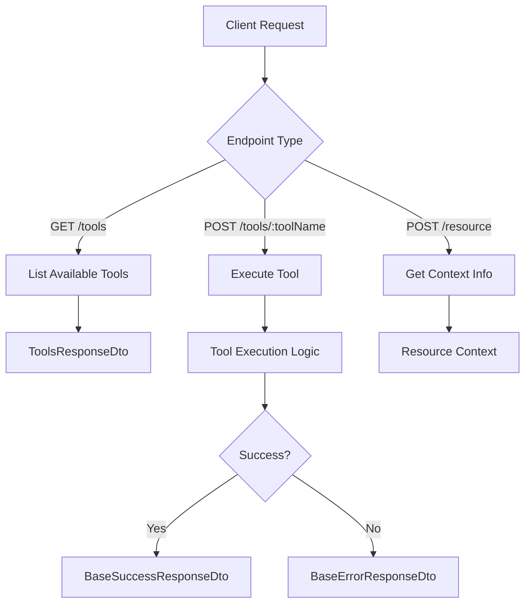
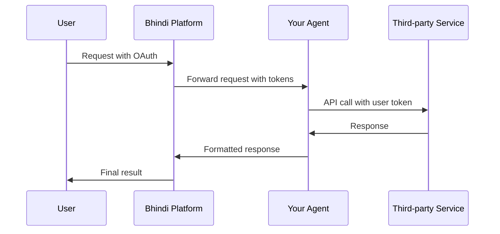

<Note>
  This guide explains how to create external agents that integrate with the
  system. Each agent must implement specific endpoints and follow authentication
  patterns.
</Note>

## 🏗️ Agent Architecture Overview

<Info>
  Every Bhindi agent follows a standardized architecture pattern with required
  and optional endpoints.
</Info>



<CardGroup cols={3}>
<Card title="Required Endpoints" icon="check-circle">
**2 mandatory endpoints** that every agent must implement for core functionality
</Card>

<Card title="Optional Endpoints" icon="plus-circle">
  **1 optional endpoint** for enhanced context and resource management
</Card>

<Card title="Standardized Responses" icon="code">
**Consistent response format** across all agents for predictable integration
</Card>
</CardGroup>

## 📋 Required Endpoints

### 1. GET /tools (Required)

<Card title="Tool Discovery Endpoint" icon="list">
  Returns available tools for the agent, enabling dynamic tool discovery and
  documentation.
</Card>

**Response Type:** `ToolsResponseDto`

<Accordion title="Type Definitions">
```typescript
export class ToolsResponseDto {
  tools: ToolDto[];
}

export class ToolDto {
  name: string; // Tool identifier
  description: string; // What the tool does
  parameters: ToolParameterDto; // JSON Schema for parameters
  confirmationRequired?: boolean; // If true, the tool will require user confirmation
}

export class ToolParameterDto {
  type: 'object';
  properties: Record<string, PropertyDto>; // List of properties for the object
  required?: string[]; // List of required parameters
}

export class PropertyDto {
  type: 'string' | 'number' | 'boolean' | 'array' | 'object';
  description: string;
  enum?: string[]; // If the parameter is an enum, list the possible values
  default?: string | number | boolean; // Default value for the parameter
  items?: PropertyDto; // If the parameter is an array, list the items
}
```
</Accordion>

<Tabs>
<Tab title="Example Implementation">
**Slack Agent Tool Definition:**

```typescript
tools: [
  {
    name: "sendMessage",
    description:
      "Send a message to a Slack user or channel. No need for exact name, it searches through all users and channels.",
    parameters: {
      type: "object",
      properties: {
        query: {
          type: "string",
          description:
            "Name of the user/channel to send message to. Can be a user name, channel name, or a channel id.",
        },
        type: {
          type: "string",
          description:
            'Type of recipient: "user", "channel", "id", or "unknown".',
          enum: ["user", "channel", "id", "unknown"],
          default: "unknown",
        },
        text: {
          type: "string",
          description: "Text content of the message",
        },
        threadTs: {
          type: "string",
          description: "Optional thread timestamp to reply to a thread",
        },
      },
      required: ["query", "text"],
    },
    confirmationRequired: true,
  },
];
```

</Tab>

<Tab title="Best Practices">
<CardGroup cols={2}>
<Card title="Clear Descriptions" icon="message-dots">
Provide detailed, user-friendly descriptions for tools and parameters
</Card>

<Card title="Smart Defaults" icon="gear">
  Use sensible defaults to reduce required parameters
</Card>

<Card title="Enum Validation" icon="list-check">
  Use enums for parameters with limited valid values
</Card>

<Card title="Confirmation Flow" icon="hand-point-up">
Set `confirmationRequired: true` for destructive or sensitive operations
</Card>
</CardGroup>
</Tab>
</Tabs>

### 2. POST /tools/:toolName (Required)

<Card title="Tool Execution Endpoint" icon="play">
  Executes a specific tool with provided parameters and returns structured
  results.
</Card>

**Parameters:**

- `toolName` (path parameter): Name of the tool to execute
- Request body: Tool-specific parameters

**Response Type:** `BaseErrorResponseDto | BaseSuccessResponseDto<any>`

<Accordion title="Response Type Definitions">
```typescript
export class BaseErrorResponseDto {
  success: false;
  error: {
    message: string;
    code: number | string;
    details: string;
  };

constructor(
message: string,
code: number | string = 500,
details: string = '',
) {
this.success = false;
this.error = {
message,
code,
details,
};
}
}

export class BaseSuccessResponseDto<T> {
  success: true;
  responseType: string;
  data: {
    [key: string]: T;
  };

constructor(data: T, responseType: 'text' | 'html' | 'media' | 'mixed') {
this.success = true;
this.responseType = responseType;
if (responseType === 'text') {
this.data = {
text: data,
};
} else if (responseType === 'html') {
this.data = {
html: data,
};
} else if (responseType === 'media') {
this.data = {
media: data,
};
} else if (responseType === 'mixed') {
this.data = {
...data,
};
}
}
}

export class ResponseMediaItem {
  type: string;
  url: string;
  mimeType: string;
  description: string;
  metadata: object;

constructor(
type: string,
url: string,
mimeType: string,
description: string,
metadata: object = {},
) {
this.type = type;
this.url = url;
this.mimeType = mimeType;
this.description = description;
this.metadata = metadata;
}
}

````
</Accordion>

<Tabs>
<Tab title="Response Types">
<CardGroup cols={2}>
<Card title="Text Response" icon="text">
For simple text-based results like calculations, status updates, or plain text content
</Card>

<Card title="HTML Response" icon="code">
For formatted content with styling, tables, or rich text formatting
</Card>

<Card title="Media Response" icon="image">
For images, files, videos, or other media content with metadata
</Card>

<Card title="Mixed Response" icon="layer-group">
For complex responses combining multiple data types and formats
</Card>
</CardGroup>
</Tab>

<Tab title="Error Handling">
<Steps>
<Step title="Validation Errors">
Return 400 status codes with clear error messages for invalid parameters
</Step>

<Step title="Authentication Errors">
Return 401 status codes when authentication fails or tokens are invalid
</Step>

<Step title="Not Found Errors">
Return 404 status codes when requested resources don't exist
</Step>

<Step title="Server Errors">
Return 500 status codes for internal server errors with debugging details
</Step>
</Steps>
</Tab>
</Tabs>

## 🔧 Optional Endpoints

### 3. POST /resource (Optional)

<Card title="Context Enhancement Endpoint" icon="info-circle">
Provides contextual information about the current user or environment to help the agent work more effectively.
</Card>

<Tabs>
<Tab title="Use Cases">
<CardGroup cols={3}>
<Card title="GitHub Agent" icon="github">
Return user's profile, repositories, and recent activity for better context
</Card>

<Card title="MongoDB Agent" icon="database">
Return database schema information, collections, and connection status
</Card>

<Card title="Slack Agent" icon="slack">
Return user's workspace info, channels, and frequent contacts
</Card>
</CardGroup>
</Tab>

<Tab title="Implementation">
```typescript
// Example: GitHub agent resource endpoint
POST /resource
{
  "user": {
    "login": "username",
    "repositories": ["repo1", "repo2"],
    "organizations": ["org1", "org2"]
  },
  "context": {
    "recentActivity": "last_commit_info",
    "activeProjects": ["project1", "project2"]
  }
}
````

</Tab>
</Tabs>

## 🔐 Authentication

<Warning>
  All requests include authentication headers. Proper authentication is crucial
  for security and user data protection.
</Warning>

### API Key Authentication (Required)

<Card title="Server Authentication" icon="key">
  Used to authenticate the server making the request to your agent.
</Card>

- **Header:** `x-api-key`
- **Purpose:** Authenticate the Bhindi platform
- **Required:** For all endpoints

### OAuth Authentication (Optional)

<Card title="User Authentication" icon="shield-user">
  Used for agents requiring user-specific OAuth tokens for third-party services.
</Card>

<Tabs>
<Tab title="Configuration">
- **Header:** `x-api-key` (Server auth)
- **Header:** `Authorization: Bearer <token>` (User auth)
- **Examples:** Twitter, Slack, GitHub agents
</Tab>

<Tab title="Flow Diagram">

</Tab>
</Tabs>

### Variable Headers (Optional)

<Card title="Custom Configuration" icon="sliders">
  For agents requiring custom configuration values or connection parameters.
</Card>

<Accordion title="Examples">
  - **MongoDB Agent**: `x-mongo-db-uri` for database connection - **Redis
  Agent**: `x-redis-host`, `x-redis-port`, `x-redis-password` - **Custom APIs**:
  `x-custom-endpoint`, `x-custom-timeout`
</Accordion>

## 🚀 Getting Started

<Steps>
<Step title="Choose Your Stack">
<CardGroup cols={3}>
<Card title="Express.js" icon="node-js" href="/custom-agent/quickstart">
Our recommended MongoDB starter kit with Express.js
</Card>

<Card title="Next.js" icon="react">
  Full-stack framework with built-in API routes
</Card>

<Card title="Custom Framework" icon="code">
Any HTTP server that can implement the required endpoints
</Card>
</CardGroup>
</Step>

<Step title="Implement Required Endpoints">
  <Check>GET /tools - Tool discovery endpoint</Check>
  <Check>POST /tools/:toolName - Tool execution endpoint</Check>
</Step>

<Step title="Add Authentication">
  <Check>API key validation</Check>
  <Check>OAuth integration (if needed)</Check>
</Step>

<Step title="Test & Deploy">
<Check>
Local testing with cURL or Postman
</Check>
<Check>
Deploy to your preferred hosting platform
</Check>
</Step>
</Steps>

<Tip>
  **Ready to start building?** Check out our [MongoDB Agent
  Quickstart](/custom-agent/quickstart) for a hands-on example with complete
  code and testing instructions.
</Tip>
